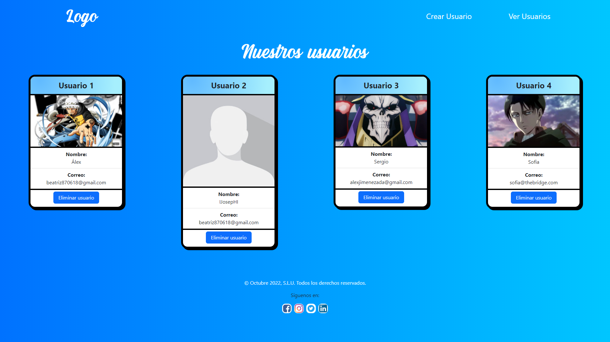
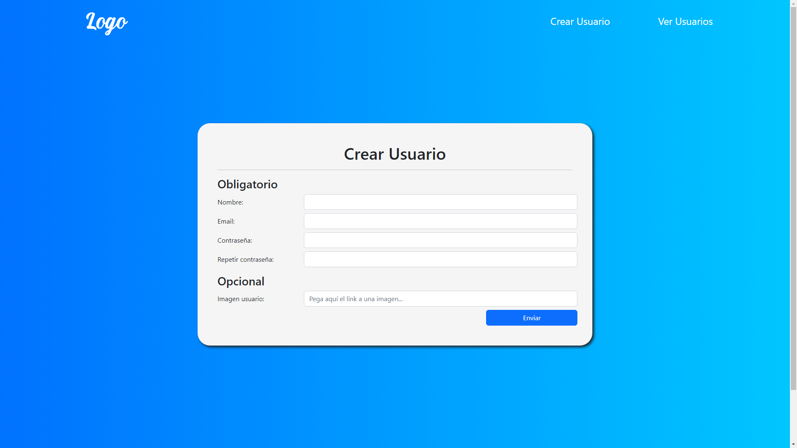

# Proyecto Bootstrap 🔥

Este es un proyecto en el cual se ha usado Bootstrap para estructurar una página que consiste en dos html, uno de ellos para crear usuarios y otro en el cual se
visualizan los usuarios creados. Hemos usado HTML, CSS y el lenguaje de JavaScript. 

En este enlace hay un resumen de las características y utilidades que tiene BootsTrap: 
https://docs.google.com/document/d/1pt9JqfckgN4Z1cU0YvTMw_eX_nGJmkhxWoad_Z0KnzM/edit#

## Página para crear usuario 🚹

En esta página se incluye un logo, un menú de navegación y un formulario. Se ha utilizado BootsTrap para darle cierta maquetación a la página así como algunas clases de 
BootsTrap que mejoran el aspecto visual y la interfaz, algunos ejemplos son el botón de enviar el formulario o la Nav Bar la cual nos permitirá movernos entre los distintos
páginas . El formulario enviará la información recogida a través de los inputs y la almacenará en el local storage.

## Página para ver usuarios creados 👀

Aquí se visualizarán todos los usuarios que se han guardado en el local storage, los cuales se se recogerán en tarjetas que comprenderán la información recogida de los 
usuarios a través de los inputs del formulario así como la imágen que el usuario haya elegido mediante una url la cual copiará en el registro.

😊Hecho por [Alex Jiménez](https://github.com/radikalex) y [Sergio Juan Vidal](https://github.com/SergioJ-Vidal)😊
